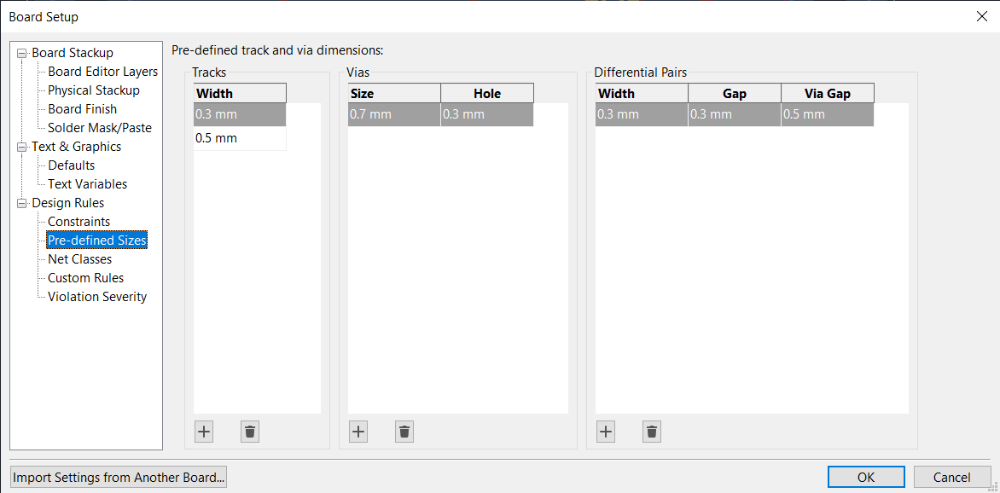

# STM32 PCB design

## Introduction

Target: STM32 blue pill
Can be programmed using Arduino
Some improvements are planned

## Schematic

New project -> Name
Schematic editor -> draw the schematic of the PCB

Main component: the microcontroller
Let's take the same as the blue pill
STM32 -> brand
F -> flavor / familly
1 -> power level (4 is more powerful than 1)
03C8T6 -> package size / flash / ram memory

Designator to top
Name to bottom right

Pins are organized in sections
Pins at the top -> Power (VDD)
Config pings -> reset and boot0
Pin banks -> A B C
Ground pins (VSS)

Configure the device electrically to make it work

### Ground

Ground logo on the right -> power nets
Take a ground -> press E -> hide the GND label as it is obvious and makes the schematic clearer
One ground for all GND pins and then attach them with wires
Makes it cleared

VSS -> GND for digital
VSSA -> GND for analog parts of the chip (AD converter)
Typically, keep them both tied to the same ground

### Power

VDD -> Main power (typ. 3.3V)
(W = Wire for drawing connections)
(M = Move for moving objects)
VBAT -> RT clock with external battery
When not used, just tie it to the VDD +3.3V

Decoupling
Placed close to the IC
Provide small local energy storage when the IC requires peaks of power
Cannot be provided directly by the main power supply due to the long traces or wires that connect it to the IC
Results in parasitic inductance

Rule of thumb
1x 100nF per pin (VBAT or VDD)
1x Bulk decoupling close to IC -> 10uF

VDDA -> analog section of the IC
Can add extra filtering as these parts of the IC are more sensitive to noise
10n and 1u in // (recommended by STM32)
Give it a different net name +3.3VA
Filter with ferrite bead -> acts as a resistor at higher frequency -> dissipates the signal

Spec for ferrite bead -> resistance at 100MHz

### Configuration pins

NRST -> Reset with inverted logic
Pulled high to run the software on the uC
Pulled low to reset the uC
Has an internal pull-up resistor
Can be connected to an external switch
Connected to a decoupling capacitor to prevent spurious resets
Good practice to expose the pin

Provide names to Pins makes it easier during routing
Add net label

BOOT0 enables or disables the internal bootloader of the uC
Programming via JTAG or serial wire debug
Used STLINK debug probe

* Good for live variables or break points
  If not using the STLINK
* Pull BOOT0 high to launch the bootloader
* Enables UART, USB, etc.
* Program the micro controller
  We want to be able to flash this device via USB
* Requires BOOT0 high when plugging in the computer
  * Device appears as programmable device
* When restart the device with BOOT0 low
  * Device runs the flashed code
    Switch so we can change the mode
    BY default -> just run 

At this point the system would boot up

### Pin-out

Let's add an external oscillator that is more accurate and Pin out some interfaces
This requires installing CUBE ide

New project in cubeIDE -> target selector

Click on a pin and choose its function
Or select on the tabs on the left

USB enables
Cristal enable
Rest of the pins to GPIO headers
-> Makes a nice generic board

SYS
    Choose preferred debug method -> Serial wire
RCC
    High speed clock -> enable -> crystal ceramic resonator
USB
    USB -> FS

Once all pins are selected and highlighted
You can add net names in KC to the useful pins 

Differential pairs like USB are recognized by KC by having the same name but ending with + and - respectively

### Cristal

Typically four pin packages for SMD Crystal_GND24

AN2867 oscillator design guide -> vey useful
The MUC already has a feedback resistor and inverter internally to form part of the oscillator
Externally, there is some parasitic capacitance CS
An oscillator we can choose
Load capacitors on each side
Feed resistor (sometimes) to limit the distortion and the overdriving of the crystal
(Not often used)

Load capacitors should be equal in value and depend on the chosen crystal
The crystal has an internal load capacitance (here 10pF)
Subtract the stray capacitance (typ: 3-5pF)
Multiply that by two
Here (10 -5)*2 = 10pF

### USB

USB Device only -> Leave the shield floating
Press Q to add a "Do not connect" marker
ID is mostly used for usb-on-the-go (switch between device and master) -> also not connected here
VBUS -> power input -> Typ 5V on a USB, can drop to 4.5V

AN4879 -> Application note on USB connections
Tells us that for this specific device, USB-D+ needs a 1.5k pull up to 3.3V

### SWD

Select a suitable connector
Add power and ground on them
Typically some ESD and protection would be needed on the connector
Omitted here

### Power supply

Let's go linear as we use very little power, efficiency is not a concern
Ams1117 -> overpowered, but low drop out voltage and nice input range

Linear regulators always require input and output capacitors for stability!!
The datasheet tells you the capacitors

USB supplies are fairly noisy -> good practice to add some extra filtering as the decoupling capacitors on the linear regulator are not enough
Here it is simple enough to work without in this example

Power on LED for debugging

## PCB layout

Step 1: Setup pcb
Select the stack up
Two layers -> top layer signal, bottom layer ground (power plane)
Pre-defined sizes for tracks, vias, etc.

| Element | Type    | Dimensions |
| ------- | ------- | ---------- |
| Tracks  | Signals | 0.3 mm     |
|         | Power   | 0.5 mm     |
| Vias    | Pad     | 0.7 mm     |
|         | Hole    | 0.3 mm     |

Differential pairs
    Controlled impedence is not important here as the speed is low
    OK as long as the traces are as short as possible

